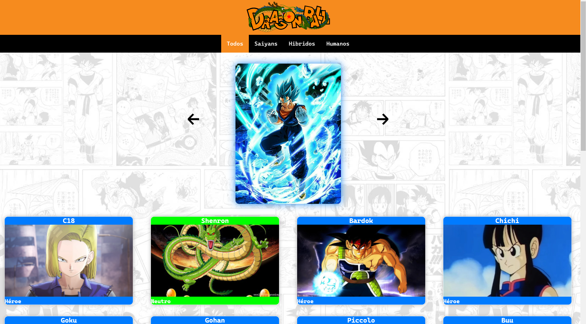
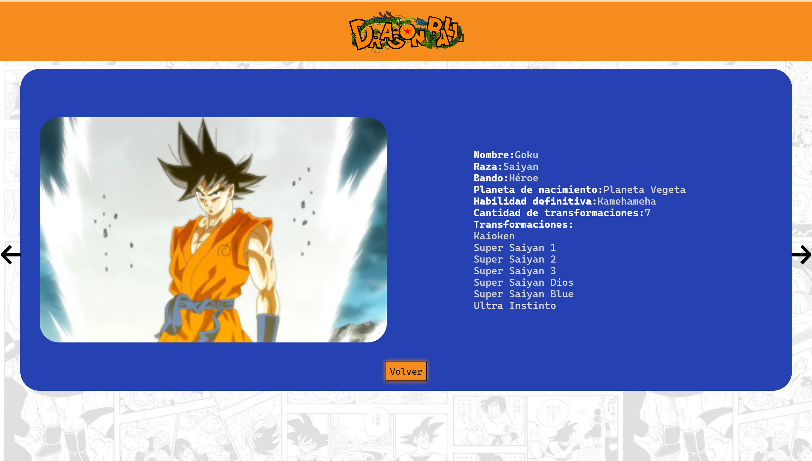
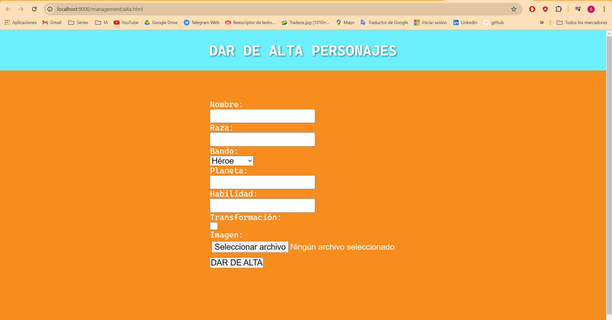
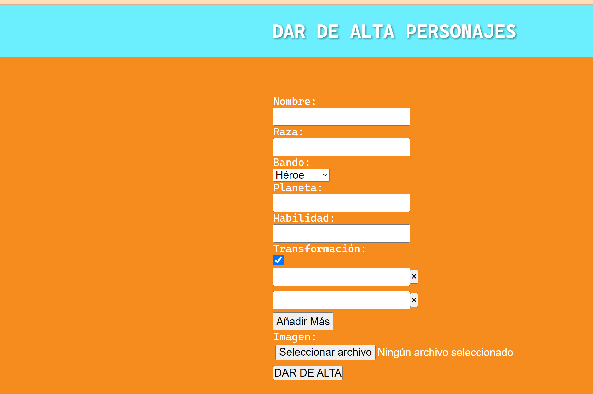
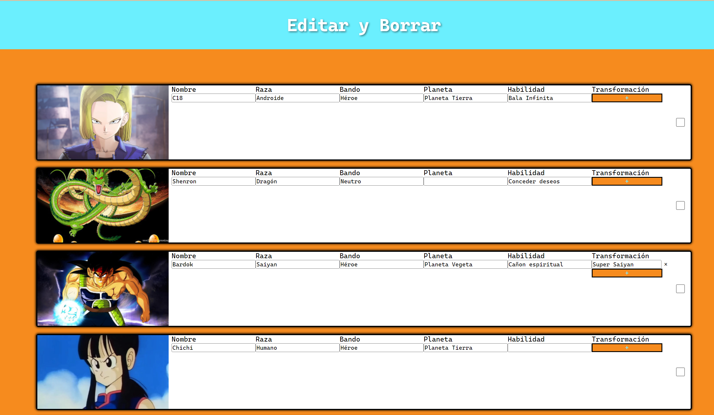
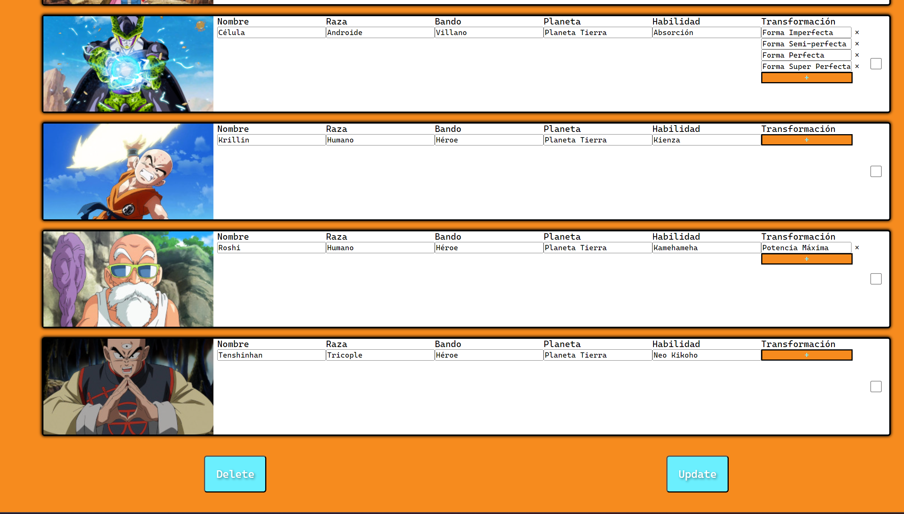

# API de Dragon Ball
Una página web dinámica hecha con nodejs en el que creo mi propia API de dragon Ball y hago un funcionamiento de dar de alta y editar/eliminar personajes.

## Caputuras de la web
### indice


### Dar de alta


### Editar/eliminar



## Explicación del proyecto
  en este caso creé una página creando una API con Postman y usandola. Un proyecto basado en html, css, javascript, nodejs, axios.

# Uso

Sin moverte de la carpeta principal usas el comando ```npm start``` para iniciar el servidor y entras en el enlace ```http://localhost:9000/dragon_ball/index.html```.
Para entrar dentro de la págian de dar de alta ```http://localhost:9000/management/alta.html```.
Y para la página de editar y eliminar ```http://localhost:9000/management/alta.html```.

## Tecnologías Utilizadas

- 
- 
- 
- 
- 
